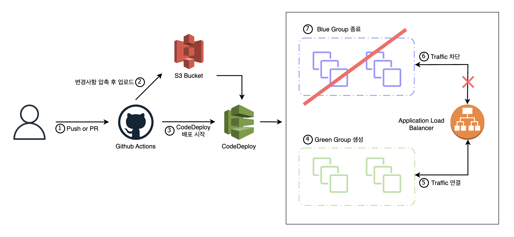

<h1 align="center">
    
      CodeDeploy 와 ASG를 이용한 Blue/Green 배포 자동화
</h1>

  
  블로그 보러가기

## 개요

AWS의 CodeDeploy, S3, EC2, AutoScalingGroup 과  
Github Actions 를 이용한 스케일링이 가능한 Blue/Green 배포 자동화입니다.

>위 블로그에 자세한 설명과 단계별 이미지가 포함되어 있습니다.